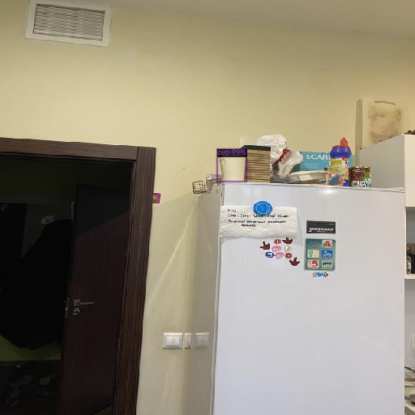

# Object Detection with YOLOv8 and Faster RCNN

This Github repository presents an evaluation of two state-of-the-art pre-trained object detection models, Faster RCNN and YOLOv8, on a custom dataset of toy venom model and coffee cup. The models were not implemented from scratch, but rather were used as pre-trained models for detecting new objects.

The repository includes evaluation metrics such as Average Precision (AP) for both models, along with their inference times. Faster RCNN achieved an AP of 0.662 with an inference time of 0.01s, while YOLOv8 achieved an AP of 0.834 with an inference time of 0.074s. The evaluation results reveal that YOLOv8 performed better in detecting small objects located at the background, while Faster RCNN was more confident in detecting objects with approximately 100% probability for each object's bounding box.

Moreover, the repository provides an efficient way to evaluate pre-trained models on custom datasets for object detection tasks. The code includes data pre-processing, model evaluation, and visualization scripts. It also allows users to fine-tune the pre-trained models on their own datasets with minimal modifications to the code.

## 1. Dataset construction

I took 102 photos of two objects: my litte toy venom model and my favorite termocup for coffee. I used a square format and high-resolution phone camera.

    
    

I tried different angles, poses, distances and environments for each object. Also, I took some photos of their combinations and model showed good results for these photos. 

## 2. Annotation

Using [Roboflow Annotate](https://roboflow.com/annotate) I created class annotations for objects and split them into test/train/val sets. I tried to put complex photos into train part to advance the capabilities of models.

    

## 3+4. Training YOLOv8 and Faster R-CNN

I trained both models following roboflow tutorials: [YOLOv8](https://blog.roboflow.com/how-to-train-yolov8-on-a-custom-dataset/), [Faster R-CNN (Detectron 2)](https://blog.roboflow.com/how-to-train-detectron2/). The most complicated part was to make them build and train.

    

<i>YOLO v8 output</i>

   

        
        
    

<i>Faster R-CNN output</i>

You can find full outputs in the notebook

## 5. Evaluation 

Based on the results, I concluded that YOLOv8 is a more accurate object detection model than Faster RCNN, with an AP of 0.834 compared to 0.662 for both objects. YOLOv8 is also better at detecting small objects located in the background, while Faster RCNN is more confident in detecting objects, giving approximately 100% probability for each object's bounding box.

In terms of inference time, Faster RCNN is faster than YOLOv8, taking only 0.01 seconds per image compared to 0.074 seconds for YOLOv8. However, this advantage of Faster RCNN in inference time might not be as significant in practical applications with large datasets or real-time object detection requirements.

It is worth noting that the training time for YOLOv8 is significantly less than for Faster RCNN. This could be an essential factor for applications where quick model training is required.

## Running the code

The code has been run in Google Colab environment. All additional libraries are installed using `pip`. You may find an original Google Colab notebook [here](https://colab.research.google.com/drive/1yJTjVd6tjFb_hbw0rPPCQkDn9JU0V3I4?usp=sharing)